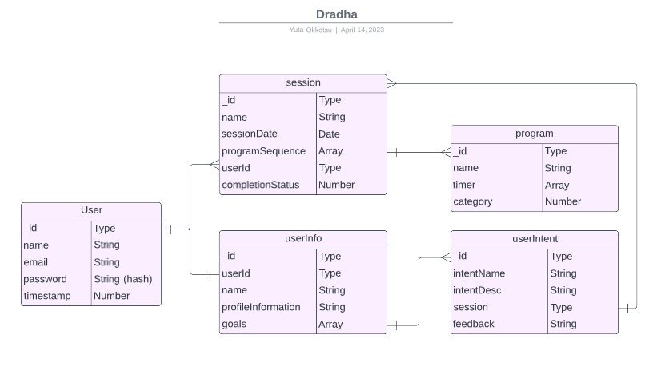

#                                   Dradha 

https://trello.com/b/GJbRgbRb/dradha-main-board
 
https://whimsical.com/N2C9ZXnuNMe18THM1xnyGu
 

#                                   Description

Dradha is a meditation and productivity app. It allows one to set a timer, and record thoughts. If there is a thought to be meditated on, or an objective to be reached in a certain time, simply write the item, and start the timer. 

Dradha is a Full-Stack MERN App that leverages the React framework, and is built upon Vite, Express, Node.js, Express.js, Mongoose, MongoDB, and styled with Tailwind CSS. 

#                                   References
[react-timer-hook](https://github.com/amrlabib/react-timer-hook)
[react-customizable-progressbar](https://github.com/martyan/react-customizable-progressbar)
[react-router-dom](https://reactrouter.com/en/main)

#                                   Technologies Used

#                                     Acknowledgements
